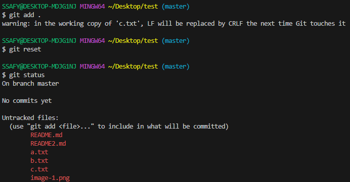

# 1. 마크 다운언어 실습
# 헤더 크기 (# 1개랑 2개는 수평선 존재)

## 헤더 크기2

### 헤더 크기3

#### 헤더 크기4

##### 헤더 크기5

# orderd 리스트

1. tab을 누르면
2. 하위 항목 생성가능
   1. 2-1이 생성됨
   2. 2-2도 생성됨
3. 3번으로 생성됨

# unordered 리스트

- +,-,* 생성이 가능하다.
+ +로 생성
* *로 생성

# 글자 굵기 및 기울임

__글자 굵기__

**글자 굵기**

글자 중간에 **굵은 글자**를 넣을땐 ** 사용

*기울임 글자*

_기울임 글자_

글자 중간에 *기울임 글자*를 넣을땐 * 한개만 사용

글자에 ***굵고 기울임 글자***를 넣을땐 *** or ___ 사용

~~취소선~~ 은 ~~ 2개로 여닫는 방식으로 생성

# 코드블록

- 코드블록의 경우
`
언어를 ```이 사이에 넣어줘야 한다. (ex. python, C, JS, Java)```
`

```python
print("hello")
```

```C
#include <stdio.h>

int main(void) {
    printf("Hello World\n");
    return 0;
}
```

# 수평선
- -를 3개 연달아 붙이면 작성된다
---

# 링크

- "[] ()" 형식으로 이루어짐
- [] 안에는 링크를 걸 이름 () 안에는 주소를 넣어주는 형태로 적용된다.
- ex) [네이버](https://www.naver.com)

# 이미지 링크

- 위의 링크와 방식은 비슷하나 ! [설명] (이미지 주소) 구조로 설정한다.
- ex) 


# 2. Git bash 터미널 사용방법

- 현재 폴더 위치를 파악(제일 중요)

    

- 현재 위치를 모를 경우 pwd 입력

    

### ls (List Segment)

- 현재 폴더의 항목들을 보여줌

    

    

### touch

- 파일을 생성 => touch 파일이름.확장자

    

- echo를 통해서 여러 파일 생성 => echo > a.txt > b.txt

    

### mkdir (Make Directory)

- 폴더를 생성 => mkdir 폴더 이름

    

### cd (Change Directory)

- cd ~을 하면 제일 최상위로 이동
- .은 현재 위치를 나타냄 ..는 상위 디렉토리 이동
- 폴더 이동 => cd 이동할 폴더

    

- 폴더 이동 간 상대 경로와 절대 경로 존재
    - 상대 경로
        - 현재 작업중인 위치를 기준으로 위나 아래로 이동

            

    - 절대 경로
      - 파일의 전체 위치를 경로로 설정하는 방법
      - C:\Users\SSAFY\Desktop\test 이러한 주소가 절대 경로
<br><br>
- tab 키를 이용한 자동 완성을 통해 쉽게 이동이 가능 (new_folder 가 존재시 new 하고 tab 입력하면 자동 완성)
- 동일한 폴더가 존재할 경우 이후 부분은 손으로 직접 작성

    

### rm (remove)

- 파일이나 폴더를 지울때 사용 => rm a.txt or rm -r test (-r 은 폴더를 지울때 사용)

    

- 비슷한 이름 한개씩 지우기 귀찮을때 *을 사용하여 모두 지움 => rm \*.txt or rm -r new_folder_\*

    

- 파일을 삭제할 경우 오류를 안보여주고 명령어 실행 => rm -f 이름

    

- 파일이 없는 경우도 삭제되는 것을 볼 수 있다

### clear

- 현재 터미널 창을 지워준다

    

    

# 3. Git

1. global user 와 email 설정
   1. git config --global user.email "이메일 입력"
   2. git config --global user.name "이름 입력"
2. git config --global -l 로 확인 가능

    

3. git init 을 입력하여 git 폴더 생성

    

4. git status 를 입력하여 add 할 수 있는 파일 목록 파악

    

5. git add 올릴 파일 명들 (모두 선택할려면 ".")

    

    .을 입력할 경우

    

    모두 들어감

6. git reset을 사용하면 add로 올린 파일들이 리셋이 된다.

    

7. git add 이후 commit 을 하여 임시공간에 저장된 내용을 로컬에 저장한다.

    

8. 이후 잘 올라갔는지 확인을 위해 git log 를 입력한다

    