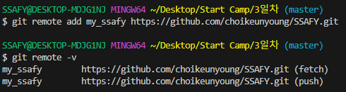

# GitHub 생성

# GitHub 사용법

1. GitHub에 업로드할 폴더와 내용물 생성

    

2. 파일들을 생성한 폴더를 add / commit 을 시행한다.

    

3. add / commit 한 파일들을 저장 할 원격 저장소 URL을 추가한다.

    - git remote add [저장할 이름] [원격 저장소 주소]

    

    - git remote -v 를 사용하여 잘 저장됐는지 확인한다
  
4. 로컬에 저장된 내용을 GitHub에 push 명령어를 사용하여 집어 넣는다.

    - git push [내가 설정한 이름] [브랜치 이름(현재는 master)]

    

    

    - 하고나면 잘 올라가 있는 것을 확인할 수 있다.