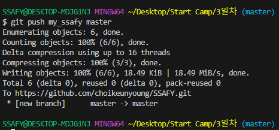

# GitHub 사용법

### 1. GitHub에 업로드할 폴더와 내용물 생성

### 2. 파일들을 생성한 폴더를 add / commit 을 시행한다.

### 3. add / commit 한 파일들을 저장 할 원격 저장소 URL을 추가한다.

- **git remote add [저장할 이름] [원격 저장소 주소]**
  
    

- **git remote -v** 를 사용하여 잘 저장됐는지 확인한다
  
### 4. 로컬에 저장된 내용을 GitHub에 push 명령어를 사용하여 집어 넣는다.

- **git push [내가 설정한 이름] [브랜치 이름(현재는 master)]**

    

    

- 하고나면 잘 올라가 있는 것을 확인할 수 있다.

### 5. git pull 과 git clone 비교하기

git pull | git clone
---------|----------
 |  
Repository에 연결된 폴더에서 변경 사항을 불러올때 사용 | 빈 폴더에 Repository 내용을 복사 붙여넣기 할때 사용
 | 
다른 폴더 혹은 다른 곳에서 작업한 내용을 변경사항 들을 pull을 입력하면 불러온다| 빈 폴더에 clone 명령어를 입력하면 Repository에 들어있는 내용을 그대로 가져온다