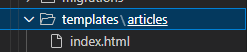

## 클라이언트와 서버

 

 1. 웹 브라우저에서 "google.com"을 입력
 2. 브라우저는 인터넷에 연결된 전세계 어딘 가에 있는 구글 컴퓨터(서버)에게 "Google 홈페이지 html"을 요청
 3. 요청을 받은 구글 컴퓨터는 데이터베이스에서 "Google 홈페이지.html"파일을 찾아 응답
 4. 전달받은 Google 홈페이지.html 파일을 웹 브라우저가 사람이 볼 수 있도록 해석해주면서 사용자는 구글의 메인 페이지를 보게 됨

### Client

 - 서비스를 요청하는 주체 ( 웹 사용자의 인터넷이 연결된 장치, 웹 브라우저 )

### Sever

 - 클라이언트와 통신을 주고받는 매체

## 프로젝트 및 가상환경

 

 - 가상 환경 : Python 애플리케이션과 그에 따른 패키지들을 격리하여 관리할 수 있는 독립적인 실행 환경
 - 가상환경 사용하는 이유
   - 의존성 관리 : 라이브러리 및 패키지를 각 프로젝트마다 독립적으로 사용 가능
   - 팀 프로젝트 협업 : 모든 팀원이 동일한 환경과 의존성 위에서 작업하여 버전간 충돌을 방지


### 의존성 패키지

 - 한 소프트웨어 패키지가 다른 패키지의 기능이나 코드를 사용하기 때문에 그 패키지가 존재해야만 제대로 작동하는 관계
 - 사용하려는 패키지가 설치되지 않았거나, 호환되는 버전이 아닌 경우 오류가 발생하거나 예상치 못한 동작을 보일 수 있다.
 - 개발 환경에서는 각각 프로젝트가 사용하는 패키지와 그 버전을 정확히 관리하는 것이 중요

## 프로젝트 순서

 ```bash
    # 가상환경 생성
    python -m venv venv

    # 가상환경 실행
    source venv/Scripts/activate

    # 가상환경 설치파일 확인
    pip list

    # 가상환경 패키지 txt 로 저장
    pip freeze > requirements.txt

    # 프로젝트 생성
    django-admin startproject firstpjt .(현재위치)

    # Django 서버 실행
    python manage.py runserver
    # http://127.0.0.1:8000/ 접속 후 확인
 ```

 1. 가상환경 생성
 2. 가상환경 활성화
 3. Django 설치
 4. 의존성 파일 생성 (패키지 설치시마다 진행)
 5. .gitignore 파일 생성 (첫 add 전)
 6. git 저장소 생성
 7. Djnago 프로젝트 생성

 - Django project : 애플리케이션의 집합 (DB 설정, URL 연결, 전체 앱 설정 등을 처리)

 - Django application : 독립적으로 작동하는 기능 단위 모듈

 ```bash
    # app 생성
    python manage.py startapp articles

    # app 등록
    # 생성된 app 에서 settings.py 에서 설정
    INSTALLED_APPS = [
        "추가할 앱 이름",
        "~~~~~~~~~~~~~",
        "~~~~~~~~~~~~~",
        "~~~~~~~~~~~~~",
        "~~~~~~~~~~~~~",
    ]
 ```

 - 앱을 생성한 후 앱을 등록해야함.

# Django Design Pattern

 - 소프트웨어 설계에서 발생하는 문제를 해결하기 위한 일반적인 해결책

### MVC 디자인 패턴 (Model, View, Controller)

 - 애플리케이션을 구조화하는 대표적인 패턴 (데이터, 사용자 인터페이스, 비즈니스 로직을 분리)

### MTV 디자인 패턴 (Model, Template, View)

 - Django에서 애플리케이션을 구조화하는 패턴 (기존 MVC 패턴과 동일하나 명칭을 다르게 정의한 것)
 - View == Template // Controller == View
 - Model
   - 데이터와 관련된 로직을 관리
   - 응용프로그램의 데이터 구조를 정의하고 데이터베이스의 기록을 관리
 - Template
   - 레이아웃과 화면을 처리
   - 화면상의 사용자 인터페이스 구조와 레이아웃을 정리
 - View
   - Model & Template과 관련한 로직을 처리해서 응답을 반환
   - 클라이언트의 요청에 대해 처리를 분기하는 역할
 - View 예시
   - 데이터가 필요하다면 model에 접근해서 데이터를 가져오고
   - 가져온 데이터를 template로 보내 화면을 구성하고,
   - 구성된 화면을 응답으로 만들어 클라이언트에게 반환

 

## 프로젝트 구조
 
 
 
 - settings.py : 프로젝트 모든 설정 관리
 - urls.py : URL과 이에 해당하는 적절한 views를 연결
 - __init__.py : 해당 폴더를 패키지로 인식하도록 설정
 - asgi.py : 비동기식 웹 서버와의 연결 관련 설정
 - wsgi.py : 웹 서버와의 연결 관련 설정
 - manage.py : Django 프로젝트와 다양한 방법으로 상호작용 하는 커맨드라인 유틸리티

## 앱 구조

 

  - admin.py : 관리자용 페이지 설정
  - models.py : DB와 관련된 Model을 정의 / MTV 패턴의 M
  - views.py : HTTP 요청을 처리하고 해당 요청에 대한 응답을 반환 (url, mode, template과 연계) / MTV 패턴의 V
  - apps.py : 앱의 정보가 작성된 곳
  - tests.py : 프로젝트 테스트 코드를 작성하는 곳

## Django와 요청 & 응답

 

 - URLs : 127.0.0.1:8000/articles/ 로 요청이 왔을 때 views 모듈 index 함수를 호출

 ```python
    from django.contrib import admin
    from django.urls import path
    from articles import views

    urlpatterns = [
        path('admin/', admin.site.urls),
        path('articles/', views.index),
    ]
 ```
 - View : 특정 경로에 있는 template과 request 객체를 결합해 응답 객체를 반환하는 index view 함수 정의

 ```python
    from Django.shortcuts import render

    def index(request):
        return render(request, "articles/index.hmtl")
 ```

 - Template
    1. articles 앱 폴더 안에 templates 폴더 생성 ( 폴더 명은 반드시 templates 여야 하며 직접 생성해야 한다. )
    2. templates 폴더 안에 articles 폴더 생성
    3. artilces 폴더 안에 템플릿 파일 생성
 
 

 - template 인식하는 경로 규칙
   - app폴더 / templates / articles / index.html
   - app폴더 / templates / example.html

 

 - app폴더 / templates 까지는 기본 경로로 인식함

### 데이터 흐름에 따른 코드 작성

 - URLs => View => Template

 


## render 함수

 - 주어진 템플릿을 주어진 컨텍스트 데이터와 결합하고 렌더링 된 텍스트와 함께 HttpResponse(응답) 객체를 반환하는 함수
  
 1. request : 응답을 생성하는 데 사용되는 요청 객체
 2. template_name : 템플릿 이름의 경로
 3. context : 템플릿에서 사용할 데이터 (딕셔너리 타입으로 작성)

 <h3><b>render(request, templat_name, context)</b></h3>