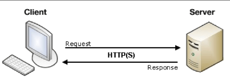
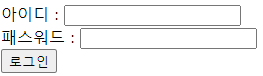
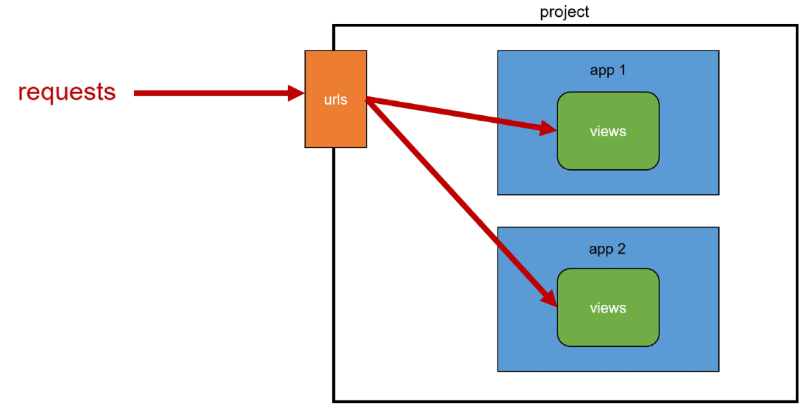
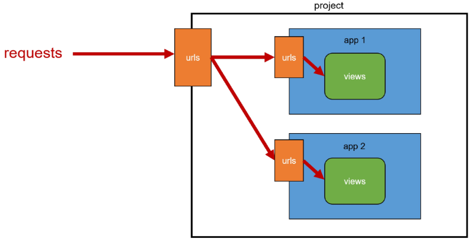

# Django Template System

 - 데이터 표현을 제어하면서, 표현과 관련된 부분을 담당
 - HTML의 콘텐츠를 변수 값에 따라 바꾸고 싶을 경우

```python
    def index(request):
        context = {
            "name" : "Jane",
        }
        return render(request, "articles/index.html", context)
```
```html
    <body>
        <h1>Hello, {{ name }}</h1>
    </body>
```

## Django Template Language

 - Template에서 조건, 반복, 변수 등의 프로그래밍적 기능을 제공하는 시스템

 **1. Variable {{ variable }}**

 - render 함수의 세번째 인자로 딕셔너리 데이터를 사용
 - 딕셔너리 key에 해당하는 문자열이 template에서 사용 가능한 변수명이 됨
 - dot(.)를 사용하여 변수 속성에 접근할 수 있음

 **2. Filters {{ variable|filter }} / {{ name|truncatewords:30 }}**

 - 표시할 변수를 수정할 때 사용
 - chained가 가능하며 일부 필터는 인자를 받기도 함
 - 약 60개의 built-in template filters를 제공

 **3. Tags  /  **

 - 반복 또는 논리를 수행하여 제어 흐름을 만듦
 - 일부 태그는 시작과 종료 태그가 필요
 - 약 24개의 built-in template tags를 제공

 **4. Comments**

 - {# #} //  

```Django
    
        
        
    
```

## 템플릿 상속 Template inheritance

 - 페이지 공통요소를 포함
 - 하위 템플릿이 재정의 할 수 있는 공간을 정의
 - 기본 "skeleton" 템플릿을 작성하여 상속 구조 구축

```django
    <!-- articles/base.html -->
    <!DOCTYPE html>
    <html lang="en">
    <head>
        <meta charset="UTF-8">
        <meta name="viewport" content="width=device-width, initial-scale=1.0">
        <title>Document</title>
    </head>
    <body>
        
         여기가 상속되는 부분 
        
    </body>
    </html>

    <!-- articles/index.html -->
    

    
        <h1>Hello, {{ name }}</h1>
    
```

 -  tag => 자식(하위)템플릿이 부모 템플릿을 확장한다는 것을 알림 (템플릿 최상단에 작성, 2개 사용 불가)
 -  => 하위 템플릿에서 재정의 할 수 있는 블록을 정의 이름이 같아야한다.

## HTML form(요청과 응답)

 - 데이터를 보내고 가져오기 => HTML form element를 통해 사용자와 애플리케이션 간의 상호작용 이해하기

 

 - form 구조

 

```HTML
<form action="#" method="GET">
    <div>
        <label for="name">아이디 : </label>
        <input type="text" id="name">
    </div>
    <div>
        <label for="password">패스워드 : </label>
        <input type="text" name="password" id="password">
    </div>
    <input type="submit" value="로그인">
</form>
```

 - "form" element => 사용자로부터 할당된 데이터를 서버로 전송
 - GET 요청의 경우 http://127.0.0.1:8000/serach/?name=input.data 형태로 url 변화를 줌
 - https://search.naver.com/search.naver?query=hello
          목적지 URL                 /input의 name / input에 입력한 데이터
 - "action" & "method" => 데이터를 어디(action)로 어떤 방식(method)으로 요청할지

 - action
    - 입력 데이터가 전송될 URL을 지정 (목적지)
    - 만약 이 속성을 지정하지 않으면 데이터는 현재 form이 있는 페이지의 URL로 보내짐
  
 - method
    - 데이터를 어떤 방식으로 보낼 것인지 정의
    - 데이터의 HTTP request methods (GET, POST)를 지정

 - "input" element => 사용자의 데이터를 입력 받을 수 있는 요소
 - "name" attribute => 입력한 데이터에 붙이는 이름(key) 데이터 제출시 서버는 name 속성에 설정된 값을 통해서만 데이터 접근

 #### Query String Parameters

  - 사용자의 입력 데이터를 URL 주소에 파라미터를 통해 서버로 보내는 방법
  - 문자열은 앰퍼샌드(&)로 연결된 key=value 쌍으로 구성되며, 기본 URL과 물음표(?) 로 구분됨
  - 예시 http://host:port/path?key=value&key=value

### form 활용

 - HTTP request 객체 : form으로 전송한 데이터 뿐만 아니라 모든 요청 관련 데이터가 담겨 있음
 - form 데이터를 가져오는 방법
   - request.GET.get("message") => <QueryDict: {'message': ['안녕!']}> 딕셔너리 get 메서드 통해 키 값 조회

## 추가 템플릿 경로

```py
    TEMPLATES = [
    {
        "BACKEND": "django.template.backends.django.DjangoTemplates",
        "DIRS": [ BASE_DIR / "templates"], # 이부분에 BASE_DIR / templates 추가
        "APP_DIRS": True,
        "OPTIONS": {
            "context_processors": [
                "django.template.context_processors.debug",
                "django.template.context_processors.request",
                "django.contrib.auth.context_processors.auth",
                "django.contrib.messages.context_processors.messages",
            ],
        },
    },
]
```

 - 최상단 폴더에 templates 생성 후 내부에 base.html 선언
 - 각 템플릿 상단에  추가
 - BASE_DIR은 Path(__file__).resolve().parent.parent 로 장고의 프로젝트 폴더로 설정되어있다.

 **DTL 주의사항**

 - Python 처럼 일부 프로그래밍 구조를 사용할 수 있지만 명칭만 설계 되었을 뿐 Python 코드로 실행되는 것이 아니며 Python과는 관련 없음
 - 프로그래밍적 로직이 아닌 프레젠테이션을 위한 것임을 명싱할 것
 - 프로그래밍적 로직은 되도록 view 함수에서 작성 및 처리

# Django URLs

 - URL dispatcher : URL 패턴을 정의하고 해당 패턴이 일치하는 요청을 처리할 view 함수를 연결(매핑)

## 변수와 URL

 - 현재 URL의 문제점 : 템플릿의 중복 부분이 많고 URL 일부만 변경되는 상황이면 비슷해서 URL을 늘려가는 것은 비효율적이다.

```python
    urlpatterns = [
        path("articles/1/", ...),
        path("articles/2/", ...),
        path("articles/3/", ...),
        path("articles/4/", ...),
        path("articles/5/", ...),
    ]
```

### Variable Routing

 - URL 일부에 변수를 포함시키는 것
 - 작성법
   - <path_converter:variable_name>

    ```python
        path("articles/<int:num>/", views.detail),
        path("hello/<str:name>/", views.greeting),
    ```

 - path를 variable routing 하면 아래 내용들도 변경되야함

 ```python
    # urls.py
    urlpatterns = [
        path("articles/<int:num>/", views.detail),
    ]

    # views.py
    def detail(request, num):
        context = {
            "num": num,
        }
        return render(request, "articles/detail.html", context)
 ```
 ```Django
    <!-- articles/detail.html -->
    

    
        <h1>Detail</h1>
        <h3>{{ num }} 번 글 입니다.</h3>
    
 ```

### App URL mapping

 - 각 앱에 URL을 정의하는 것
 - 프로젝트와 각 앱이 URL을 나누어 관리를 편하게 하기 위함

#### 2번째 앱 pages 생성 후 발생할 수 있는 문제

 - view 함수 이름이 같거나 같은 패턴의 url 주소를 사용하게 되는 경우
 - 아래 코드와 같이 해결할 수 있으나 더 좋은 방법이 필요
 - 각각 App 에서 URL을 관리하는것

 ```python
    # firstpjt/urls.py
    from articles import views as articles_views
    from pages import views as pages_views

    urlpatterns = [
        path("pages", pages_views.index),
    ]
 ```

 

 - 위 구조에서 아래구조로 변경

 

 ```python
    # firstpjt/urls.py
    from django.urls import path, include # include 추가

    urlpatterns = [
        path("articles/", include("articles.urls")), # include의 구조는 프로젝트이름.urls
    ]

    # articles/urls.py
    urlpatterns = [
        path("index/", views.index),
    ]
 ```

 - 각 프로젝트별 URL mapping을 통해서 그 앱에서 다루는 url을 분리해주는 것이 편리하다.
 - include() : 프로젝트 내부 앱들의 URL을 참조할 수 있도록 매핑하는 함수
 - 일치하는 부분까지 잘라낸 후 남은 문자열 부분은 후속 처리를 위해 include된 URL로 전달

### URL 이름 지정

 - 기존 "articles/" 주소가 "articles/index/"로 변경됨에 따라 해당 주소를 사용하는 모든 위치를 찾아가 변경해야함
 - URL에 이름을 지어주어 이름만 기억하여 주소 변경
 - Naming URL patterns : URL에 이름을 지정하는 것

```python
    urlpatterns = [
        path("index/", views.index, name="index"),
    ]
```
```Django
    <a href=""> 링크1 </a>
    <a href=""> 링크2 </a>
    <a href=""> 링크3 </a>
```

 - "url" tag : 주어진 URL 패턴의 이름과 일치하는 절대 경로 주소를 반환
 - 

### URL 이름 공간

 - articles 앱의 url 이름과 pages 앱의 url 이름이 같은 상황
 - 단순히 이름만으로는 완벽하게 분리할 수 없음
 - 이름에 성(키, key)을 붙인다.

```python
    # articles/urls.py
    app_name = "articles"
```
```Django
    
    <!-- 위 주소가 아래로 변경됨 -->
    <!-- 좀 더 상세히 어느 앱의 url 값인지 구분이 쉬움 -->
    
```