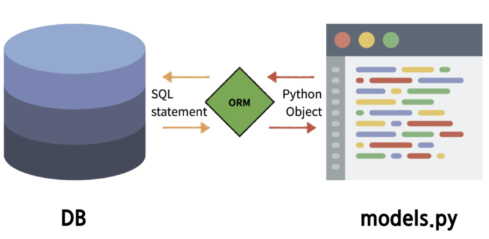

# Model

 1. Model
 2. Migrations
 3. Admin site

## Model

 

 - Django Model : DB의 테이블을 정의하고 데이터를 조작할 수 있는 기능들을 제공

```python
    # articles/models.py
    class Article(models.Model):
        title = models.CharField(max_length=10) # () 안은 제약 조건 설정
        content = models.TextField()
```
 - models.Model 은 Django 에서 이미 생성한 class 를 상속받은 것 
 - id 값은 Django에서 자동 생성

## Migrations

 - model 클래스의 변경사항(필드 생성, 수정, 삭제 등)을 DB에 최종 반영하는 방법