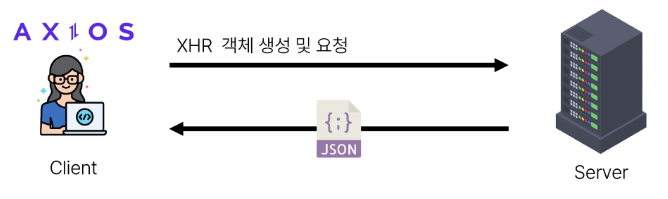

# Ajax with Django

 - Ajax와 서버
 - Ajax with follow
 - Ajax with likes

## Ajax와 서버

 

 - 클라이언트 / 서버
 - 이벤트 발생 -> XML 객체 생성 및 요청 -> Ajax 요청 처리 -> 응답 데이터 생성 -> JSON 데이터 응답 -> 응답 데이터를 활용해 DOM 조작

## Ajax with follow

 1. M:N까지 진행한 Django 프로젝트 준비
 2. 가상 환경 생성 및 활성화, 패키지 설치


 - Ajax 적용
 ```HTML
    <script src="https://cdn.jsdelivr.net/npm/axios/dist/axios.min.js"></script>
 ```

 - form 요소 선택을 위해 id 속성 지정 및 선택
 - action 과 method 속성은 삭제 (요청은 axios로 대체되기 때문)
 ```HTML
    <form id = "follow-form">
        </form>
    <script>
        const formTag = document.querySelector("#follow-form")
    </script>
 ```

 - form 요소에 이벤트 핸들러 작성 및 submit 이벤트의 기본 동작 취소
 ```JS
    formTag.addEventListener("submit", function(event) {
        event.preventDefault();
    })
 ```

 - axios 요청 작성
   1. url에 작성할 user pk는 어떻게 작성해야 할까?
   2. csrftoken은 어떻게 보내야 할까?
   ```JS
    formTag.addEventListener("submit", function(event) {
        event.preventDefault();
        axios({
            method : "POST",
            url : `/accounts/${}/follow/`,
        })
    })
   ```

 - url에 작성할 user pk 가져오기 (HTML => JavaScript)
 ```HTML
    <form id="follow-form" data-user-id="{{ person.pk }}">
        </form>
    <script>
        formTag.addEventListener("submit", function(event) {
            event.preventDefault();
        const userId = formTag.dataset.userId
    })
    </script>
 ```

### data-* 속성

 - 사용자 지정 데이터 특성을 만들어 임의의 데이터를 HTML과 DOM사이에서 교환할 수 있는 방법
 ```HTML
    <div data-my-id="my-data"></div>
    <script>
        const myId = event.target.dataset.myId
    </script>
 ```
 - 모든 사용자 지정 데이터는 JavaScript에서 dataset 속성을 통해 사용
 - 주의사항
   1. 대소문자 여부에 상관없이 'xml' 문자로 시작 불가
   2. 세미콜론 포함 불가
   3. 대문자 포함 불가

 - 요청 url 작성 마무리
 ```JS
    formTag.addEventListener("submit", function(event) {
        event.preventDefault();
        
        const userId = formTag.dataset.userId

        axios({
            method : "POST",
            url : `/accounts/${userId}/follow/`,
        })
    })
 ```

 - 문서상 hidden 타입으로 존재하는 csrf 데이터를 axios로 전송을 해야한다.
 ```JS
    const csrftoken = document.querySelector('[name=csrfmiddlewaretoken]').value;

    formTag.addEventListener("submit", function(event) {
        event.preventDefault();

        const userId = formTag.dataset.userId;
        axios({
            method : "POST",
            url : `/accounts/${userId}/follow/`,
            headers : {'X-CSRFToken' : csrftoken,},
        })
    })
 ```

 - 팔로우 버튼을 토글하기 위해서 현재 팔로우가 상태인지 언팔로우 상태인지에 대한 상태 확인이 필요


## 콜백 함수를 사용하면

 - return 없이도 정상적인 흐름 or 비정상적인 흐름을 구성할 수 있음
 - 다른 코드들에서는 왜 예제같은 방식을 자주 볼 수 없는가?
   - 콜백 함수가 중첩되어 가독성이 떨어지고 코드가 복잡해지는 현상(콜백 지옥)이 발생함
   - 콜백 지옥(callback hell)
     - 가독성이 매우 떨어짐
     - 에러 처리가 어려움
     - 순서 보장을 위한 코드 작성이 어렵다

 - 해결방법1. Promise

 - Promise : 다음에 할 행동을 약속한다!
   - resolve() : 
     - Promise 객체가 실패할 때 호출되어 결과 값 전달
   - reject() : 
     - Promise 객체가 실패할 때 호출되어 결과 값 전달
   - then()
     - 로직 이행 성공 시 then 으로 넘어감 (resolve 호출 시)
   - catch()
     - 로직 이행 실패 시 catch 으로 넘어감 (reject 호출 시)

 - 해결방법2. Async * Await
   - ES8(ECMAScript 2017) 부터 등장
   - async : 해당 함수가 비동기 함수라는 것을 명시
   - await : 함수 실행 후 결과를 기다리는 키워드