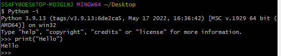

# 프로그래밍

  - 명령어들의 집합
  - 프로그래밍의 핵심 => 문제를 해결하는 매우 강력한 방법
  - 프로그래밍 언어 => 컴퓨터에게 작업을 지시하고 문제를 해결하는 도구

# 파이썬

  - 간결하고 읽기 쉬움
  - 다양한 응용 분야 => 데이터 분석, 인공지능, 웹 개발, 자동화
  - 커뮤니티 지원 => 언어가 살아남기 위해서는 사람들이 많이 사용하고 커뮤니티가 활성화 되야한다.

  - 파이썬은 인터프리터 언어로 구성되어 있다.
    - 프로그래머가 작성한 코드를 기계어로 변환하는 과정 없이 한 줄 해석해서 바로 명령어를 실행
    - 기계어로 변환하지 않기 때문에 빌드 과정 없이 실행 가능
    - 런타임 상황에서 한 줄씩 읽기 때문에 컴파일 언어에 비해 속도가 느리다.
    - 프로그램 수정이 간단


    

## 파이썬 인터프리터 사용하는 2가지 방법

  1. shell 이라는 프로그램으로 한 번에 한 명령어 씩 입력해서 실행
    
    

  2. 확장자가 .py인 파일에 작성된 파이썬 프로그램을 실행


## 표현식과 값

  
<br>
  - 표현식(Expression) : 값, 변수, 연산자 등을 조합하여 계산되고 결과를 내는 코드 구조 ( 5 * 21 - 4 )
  - 평가(Evaluate) : 표현식이나 문장을 순차적으로 평가하여 프로그램의 동작을 결정
  - 문장 : 실행 가능한 동작을 기술하는 코드
<br>
  ```python
    if a > b: # if a > b 는 문장 a > b 는 표현식
        break
    # 문장안에 표현식이 들어있음
  ```

## 타입

  - 값이 어떤 종류의 데이터인지, 어떻게 해석되고 처리되어야 하는지 정의
  
### 데이터 타입

  - Numeric Type : 숫자형 데이터로 사칙연산 뿐만 아니라 수학적 기능이 사용 가능한 타입

    - int(정수)

    ```python
        a = 1 # int()
        b = 2 # int()
    ```

    - float(실수)

    ```python
        a = 1.00 # float()
        b = 3.24 # float()
    ```

    - complex(복소수)

    ```python
        a = 2 + 3j #complex()
        b = 1 + 4j #complex()
    ```

  - Sequence Types : 순서가 유지되고, 정수로 인덱싱하며, 길이가 존재

    - list => 내부 값을 변화시킬 수 있다.

    ```python
        a = [1, 2, 3, 4]
        b = list()
        c = []
        # a에 1, 2, 3, 4 이 들어있으며 값을 바꿀 수 있다.
        # a[0] = 6 넣으면 1이 6으로 변함
    ```

    - tuple => 내부 값을 변화할 수 없다.

    ```python
        a = (1, 2, 3)
        b = tuple()
        # a에 1, 2, 3 이 들어있으며 이 값들을 바꿀 수 없다.
        # a[0] = 6 넣으면 에러가 발생
    ```

    - range

    ```python
        range(0, 5)
        # 0, 1, 2, 3, 4
        range(10, 5, -1)
        # 10, 9, 8, 7, 6
        range(0, 6, 2)
        # 0, 2, 4
    ```

    - str

    ```python
        "Hello"
        "Hi"
    ```

  - Set Types
    - set

  - Mapping Types
    - dict

  - 기타
    - None
    - Boolean

## 산술 연산자 & 우선 순위


## 변수와 메모리 값이 저장되는 법

  - 변수(Variable) : 값을 참조하는 이름

### 변수명 규칙

  - 영문 알파벳, 언더스코어(_), 숫자로 구성
  - 숫자로 시작할 수 없음
  - 대소문자 구분
  
  