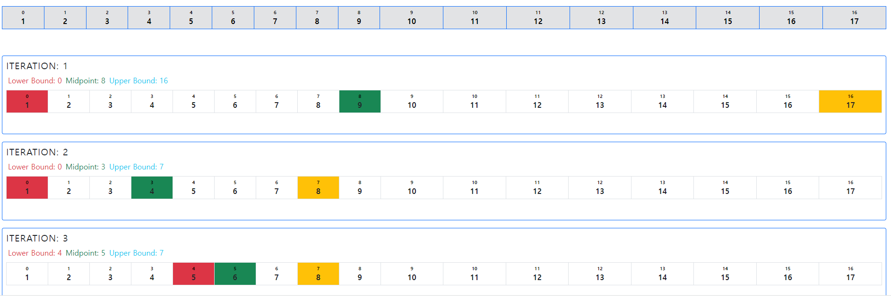

# 알고리즘

 - 문제를 해결하기 위한 절차나 방법
 - 어떠한 문제를 해결하기 위한 절차
 - 무엇이 좋은 알고리즘 인가?

    1. 정확성 : 얼마나 정확하게 동작하는지
    2. 작업령 : 얼마나 적은 연산으로 원하는 결과를 얻는가
    3. 메모리 사용량 : 얼마나 적은 메모리를 사용하는가
    4. 단순성 : 얼마나 단순한가
    5. 최적성 : 더 이상 개선할 여지 없이 최적화 되었는가
   
 - 알고리즘의 효율을 측정하기 위해서는 시간 복잡도(Time Complexity)를 통해 측정한다.

## 시간 복잡도(Time Complexity)

 - 실제 걸리는 시간 측정
 - 실행되는 명령문의 개수 계산
  
 ```python
    # 알고리즘 1
    def CalcSum( n ):
        sum = 0 # 1 번
        for i in range(1, n+1): # n 번
            sum += i # n 번
        return sum
    # 1 + n * 2 = 2n + 1 번 연산

    # 알고리즘 2
    def CalcSum( n ):
        return n * (n+1)//2 # 3 번
    # 3번 연산
 ```

 - 빅-오(Big-O) 표기법으로 계산

    

    

# 배열

 - 일정한 자료형의 변수들을 하나의 이름으로 열거하여 사용하는 자료구조
 - 프로그램 내에서 여러 개의 변수가 필요할 때 효율적으로 관리하기 위해 사용

### 1차원 배열의 선언

 - 별도의 선언이 없으면 처음 값을 할당할 때 생성

 ```python
    Arr = list()
    Arr = []
    Arr = [1, 2, 3]
    Arr = [0] * 10
    # 방법등 다양하게 생성 가능
 ```

### 2차원 배열의 선언

 - 1차원 List를 묶어놓은 List
 - 세로길이(행의 개수), 가로길이(열의 개수)를 필요로 한다

 ```python
    arr = [ [0, 1, 2, 3], [4, 5, 6, 7] ] # 2행 4열의 2차원 List
    # 0 1 2 3
    # 4 5 6 7

    # 2차원 리스트 생성 방식
    # 1. 
    # N = 3
    # 1 2 3 
    # 4 5 6
    # 7 8 9
    N = int(input())
    arr = [ list(map(int,input().split())) for _ in range(N) ]

    # 2.
    # N = 3
    # 123
    # 456
    # 789
    N = int(input())
    arr = [ list(map(int,input())) for _ in range(N) ]
 ```

### 배열의 접근 방법

 - Arr[0] = 10 => Arr의 0번 원소에 10을 저장
 - Arr[idx] = 20 => Arr의 idx 원소에 20을 저장하라

 - 2차원 배열의 경우 arr[행][열] 의 방식으로 탐색을 해야한다.
 - Arr[1][2] = 10 => Arr의 1번째 행에 2열에 10을 넣어라.

 ```python
    # 행 우선 순회
    for i in range(n):
        for j in range(m):
            print(Arr[i][j]) # 열은 고정한 후 행의 값의 반복문을 먼저 시행

    # 열 우선 순회
    for j in range(n):
        for i in range(n):
            print(Arr[i][j]) # 행은 고정한 후 열의 값의 반복문을 먼저 시행

    # 지그재그 순회
    for i in range(n):
        for j in range(m):
            print(Arr[i][j + (m-1-2*j) * (i%2)]) # i 값이 홀수인 경우 끝에서부터 0번 인덱스까지 짝수이면 0 부터 끝까지

    # 델타를 이용한 배열 탐색
    dx = [0, 1, 0, -1]
    dy = [1, 0, -1, 0]

    for i in range(N):
        for j in range(N):
            for k in range(4): # 선언한 방향배열을 한개씩 탐색하며
                ni = i + dx[k]
                nj = j + dy[k]
                if (0 <= ni < N) and (0 <= nj < N): # dx, dy 로 지정해준 방향을 탐색하는데 리스트 범위를 벗어나지 않을 경우
                    print(Arr[ni][nj])
    
    # 전치 행렬
    for i in range(3):
        for j in range(3):
            if i < j: # i 값이 j 보다 작은 경우 대칭되는 좌표의 값을 바꿔준다.
                arr[i][j], arr[j][i] = arr[j][i], arr[i][j]
 ```

# 정렬

 - 2개 이상의 자료를 특정 기준에 의해 작은 값부터 큰 값(오름차순 : ascending), 혹은 그 반대 순서(내림차순 : descending) 재배열하는 것
 - 대표적인 정렬 방식의 종류
   - 버블 정렬 (Bubble Sort)
   - 카운팅 정렬 (Counting Sort)
   - 선택 정렬 (Selection Sort)
   - 퀵 정렬 (Quick Sort)
   - 삽입 정렬 (Insertion Sort)
   - 병합 정렬 (Merge Sort)

    알고리즘 | 평균 수행시간 | 최악 수행시간 | 알고리즘 기법 | 비고
    ---------|----------|---------|----------|---------
     버블 정렬 | O(n^2) | O(n^2) | 비교와 교환 | 코딩이 가장 쉬움
     카운팅 정렬 | O(n+k) | O(n+k) | 비교환 방식 | n이 비교적 작을 때만 가능
     선택 정렬 | O(n^2) | O(n^2) | 비교와 교환 | 교환의 회수가 버블, 삽입정렬보다 작다.
     퀵 정렬 | O(n log n) | O(n^2) | 분할 정복 | 최악의 경우 O(n^2) 이지만, 평균적으로 가장 빠르다.
     삽입 정렬 | O(n^2) | O(n^2) | 비교와 교환 | n의 개수가 작을 떄 효과적
     병합 정렬 | O(n log n) | O(n log n) | 분할 정복 | 연결리스트의 경우 가장 효율적

## 버블 정렬 (Bubble Sort)

 - 인접한 두 원소를 비교하며 자리를 계속 교환하는 방식
 - 첫 번째 원소부터 인접한 원소끼리 계속 자리를 교환하며 맨 마지막 자리까지 이동
 - 한 과정이 끝나면 가장 큰 원소가 마지막 자리로 정렬된다.
 - 교환하는 모습이 거품같아서 버블 정렬이라 부름.
 - 시간 복잡도 => O(n^^2)

    

 ```python
    def BubbleSort(a, N): # 정렬할 List, N 원소 수
        for i in range(N-1, 0, -1): #범위 끝
            for j in range(0, i): # 비교할 원소 중 왼쪽 원소의 인덱스
                if a[j] > a[j+1]: # 왼쪽 원소가 더 크면
                    a[j], a[j+1] = a[j+1], a[j] # 오른쪽 원소와 교환
 ```

## 카운팅 정렬 (Counting Sort)

 - 항목들의 순서를 결정하기 위해 집합에 각 항목이 몇 개 있는지 세는 작업을 통해 선형 시간에 정렬하는 효율적 알고리즘
 - 정수나 정수로 표현이 가능한 자료에 대해서만 적용이 가능하다.
 - 카운트를 위한 충분한 공간을 할당하려면 집합 내 가장 큰 정수를 알아야 한다.
 - 시간 복잡도 => O(n + k) : n은 리스트 길이, k는 정수의 최대값
  
    

 ```python
    def Counting_Sort(A, B, k)
    # A - 입력 배열 / B - 정렬된 배열 / C - 카운트 배열
    C = [0] * (k+1)

    for i in range(0, len(A)):
        C[A[i]] += 1
    
    for i in range(1, len(C)):
        C[i] += C[i-1]
    
    for i in range(len(B)-1, -1, -1):
        C[A[i]] -= 1
        B[C[A[i]]] = A[i]
 ```

## 선택 정렬(Selection Sort)

 - 자료들 중 가장 작은 값의 원소부터 차례로 선택하여 위치를 교환하는 방식
 - 주어진 리스트 중 최소값을 찾고 그 값을 리스트 맨 앞에 위치한 값과 교환
 - 맨 처음 위치를 제외한 나머지 리스트를 대상으로 위 과정을 반복
 - 시간 복잡도 => O(n^2)

    

 ```python
    def SelectionSort(a, N):
        for i in range(N-1):
            minIdx = i # minIdx 값을 0부터 N-1 까지 값을 증가시키며 갱신
            for j in range(i+1, N): # i+1 인덱스부터 N 까지 탐색하며 a[minIdx] 값보다 작으면 minIdx 값을 갱신
                if a[minIdx] > a[j]:
                    minIdx = j
            # i 번 인덱스에 minIdx 인덱스 값을 교환
            a[i], a[minIdx] = a[minIdx], a[i]
 ```

# 완전 탐색(Exaustive Search)

 - 가능한 모든 경우의 수를 나열하고 확인하는 방법
 - 브루트 포스(Brute-force) or generate-and-test 라고도 불림
 - 모든 경우의 수를 다 확인해본 후 최종 정답을 출력
 - 상대적으로 경우의 수가 작을 떄 유용하게 사용된다.
 - 모든 경우의 수를 다 확인하기 때문에 속도는 느리지만 답을 찾아낼 확률이 높다.

 ```python
    target_value = 10 # 찾고자 하는 값
    num_list = [0, 1, 5, 6, 9, 10] # 값의 리스트

    for i in range(len(num_list)): # 리스트 인덱스를 순회하며
        if num_list[i] == target_value: # 만약 찾는 값을 찾았을 경우 인덱스 출력
            print(i) # 5
            break
 ```

# 탐욕 알고리즘(Greedy)

 - 최적해를 구하는 데 사용
 - 여러 경우 중 하나의 선택을 한다면 그 순간 최적이라 생각하는 것을 선택하는 방식
 - 각 시점에서 최적의 선택을 하지만 그 선택이 최적의 선택이라 할 수 없다.
 - 대표적인 문제로 거스름돈의 갯수 문제가 있다.

 ```python
    # 500, 100, 50, 10 원 동전이 존재하며 780원의 돈을 계산하기 위해서 최소 몇개의 동전이 필요할 것인가?

    money = [500, 100, 50, 10]
    TOTAL = 780
    cnt = 0

    for i in money:
        cnt += (TOTAL//i)
        TOTAL -= (TOTAL//i * i)
    print(cnt) # 7
 ```

# 비트 연산자

 - & : 비트 단위로 AND 연산을 한다.

   - 비트의 값이 같은지 다른지 판단한다.
   - 1111 & 0001 의 경우 0001 을 반환
   - 1111 & 0011 의 경우 0011 을 반환
   - 1010 & 1011 의 경우 1010 을 반환
   - 각 비트별 값이 같은지 다른지 판단.

 - | : 비트 단위로 OR 연산을 한다.

   - 각 비트별 True 값들을 반환
   - 1111 | 0000 의 경우 1111 반환
   - 1010 | 0101 의 경우 1111 반환
   - 1000 | 0001 의 경우 1001 반환
   - 각 연산자에서 True 값이 있으면 True 값을 반환

 - << : 피연산자의 비트 열을 왼쪽으로 이동시킨다.

   - 1 << n : 1을 < 으로 n 번만큼 이동시킨다.
   - n == 2 인 경우 1 에서 100
   - n == 3 인 경우 1 에서 1000
   - n == 5 인 경우 1 에서 100000

 - \>> : 피연산자의 비트 열을 오른쪽으로 이동시킨다.

   - 1 >> n : 1을 > 으로 n 번만큼 이동시킨다.
   - n == 2 인 경우 1000 에서 0010 반환
   - n == 3 인 경우 10000 에서 00010 반환
   - n == 5 인 경우 0100000 에서 0000001 반환
  
# 검색(Search)

 - 저장된 자료 중 원하는 항목을 찾는 작업
 - 목적하는 탐색 키를 가진 항목을 찾는 것
 - 검색의 종류

   - 순차 검색(sequential search)
   - 이진 검색(binary search)
   - 해쉬(hash)

## 순차 검색(Sequential Search)

 - 일렬로 된 자료를 순서대로 검색하는 방법
 - 가장 직관적이고 간단함
 - 배열이나 연결 리스트 등 순차구조로 구현된 자료구조에서 원하는 항목 찾을 때 유용
 - 구현이 단순하지만, 검색 대상의 수가 많은 경우 비효율적으로 시간이 걸림

### 정렬되어 있지 않은 경우

 - 처음 값부터 끝까지 같은 원소가 있는지 비교
 - 자료구조 끝까지 검색 대상을 찾지 못하면 실패

 ```python
    target_value = 5
    num_list = [1, 3, 10, 9 , 8, 9, 13, 5]

    for i in range(len(num_list)):
        if target_value == num_list[i]:
            print(i)
    # 리스트가 정렬되어 있지 않은경우 5를 찾기위해 모든 값들을 순회하며 값을 찾기 떄문에 최악의 경우 리스트 길이 까지 반복문을 돌리게 된다.

    num_list.sort()

    for i in range(len(num_list)):
        if target_value == num_list[i]:
            print(i)
    
    # 리스트가 정렬된 경우 정렬된 리스트에서 목표값을 빨리 찾을 수 있지만 여기또한 최악의 경우 리스트 길이 까지 반복문을 돌리게 된다.

    # 둘의 차이점은 그렇게 크게는 없지만 이렇게 두개의 경우로 나눌 수 있다.
 ```

## 이진 탐색(Binary Search)

 - 자료의 가운데 항목을 기준으로 다음 검색의 위치를 결정하고 검색을 계속 진행하는 방법
 - 자료가 정렬 된 상태에서 탐색이 가능하다.
 - 검색 과정

    1. 자료를 정렬한다.
    2. 자료의 중앙 원소를 고르고 찾고자 하는 값과 비교하여 큰지 작은지 판단한다.
    3. 중앙값 < 목표값인 경우 중앙값에서 오른쪽 범위를 다시 탐색한다. 중앙값 > 목표값인 경우 중앙값에서 왼쪽 범위를 다시 탐색한다.
    4. 찾고자 하는 값이 나올 때까지 2~3 과정을 반복한다.

    

 ```python
    def BinarySearch(a, N, key):
        start = 0
        end = N-1
        while start <= end :
            middle = (start + end) // 2 # 중앙 값을 계속 start 와 end 를 더해서 나눈 값으로 갱신
            if a[middle] == key:
                return true
            elif a[middle] > key:
                end = middle - 1
            else:
                start = middle + 1
        return false
 ```