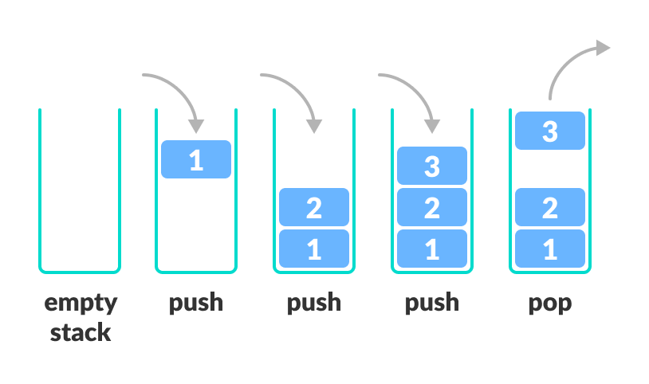
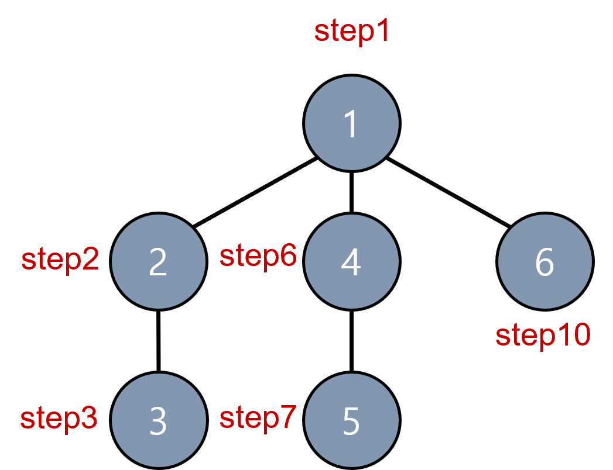

# 스택

 - 물건을 쌓아 올리듯 자료를 쌓아 올린 형태의 자료구조
 - 선형 구조를 갖는다.
   - 선형 구조 : 자료간 관계가 1:1 관계를 갖는다
   - 비선형 구조 : 자료 간의 관계가 1:N의 관계를 갖는다.
 - 자료를 삽입하거나 꺼낼 수 있다.
 - 후입선출(LIFO, Last-In-First-Out) : 마지막 삽입한 자료를 가장 먼저 꺼낸다.

### 연산

 - 삽입 : 저장소 자료를 저장한다. push 라고 부름
 - 삭제 : 저장소 자료를 꺼낸다. 삽입한 자료의 역순으로 꺼냄. pop 이라고 부름
 - 공백인지 확인 : isEmpty
 - top에 있는 원소를 반환 : peek

### 삽입 삭제 과정

 - 스택의 삽입 삭제 과정

    

 ```python
    stack = []

    stack.append(1)
    # stack = [1]
    stack.append(2)
    # stack = [1, 2]
    stack.append(3)
    # stack = [1, 2, 3]
    stack.pop() # 3
    # stack = [1, 2]
 ```

# 재귀 호출, DP(Dynamic Programming)

 - 자기 자신을 호출하여 순환 수행되는 것
 - 대표적인 예시 factorial

 ```python
    def fac(num):
        if num == 1:
            return 1
        else:
            return num * fac(num-1)

    # 피보나치 함수

    def fibo(n):
        if n < 2:
            return n
        else:
            return fibo(n-1) + fibo(n-2)
 ```

 - 재귀 함수의 경우 엄청난 수의 반복이 진행되기 때문에 불필요한 연산이 생길 수 있다.
 - 이를 해결하기 위해 메모제이션을 사용한다.
 - 메모제이션(memoization)은 프로그램을 실행할 때 이전에 계산한 값을 메모리에 저장하여 계산을 다시 하지 않도록 하여 전체적 실행속도를 빠르게 하는 기술이다.
 
 ```python
    # 피보나치 동적 계획법
    memo = [0] * (n+1)
    memo[0] = 0
    memo[1] = 1

    for i in range(2,m+1):
        memo[i] = memo[i-1] + memo[i-2]        
 ```

 - 위처럼 이전의 계산했던 값들을 저장한 후 그 값들을 통해서 이후 값을 계산해 나간다.
 - DP(Dynamic Programming)이라고 불림

# DFS(깊이우선탐색)

 - 비선형구조인 그래프 구조는 그래프로 시작 정점의 한 방향으로 갈 경로를 깊은 곳까지 모두 탐색을 한 후 더이상 갈 곳이 없다면 가장 마지막 갈림길로 돌아가 다시 갈 수 있는 방향으로 탐색한다.
 - 가장 마지막에 만났던 갈림길의 정점으로 돌아가 다시 깊이 우선 탐색을 반복해야 하므로 후입선출(LIFO) 스택 사용

    

 ```python
    def DFS(graph, v, visited):
        visited[v] = True
        for i in graph[v]:
            if not visited[i]:
                DFS(graph, i, visited)
    
    graph = [
        [],
        [2, 4, 6],
        [1, 3],
        [2],
        [1, 5],
        [4],
        [1],
    ]

    visited = [False] * 7
    DFS(graph, 1, visited)
    # 1 2 3 4 5 6
 ```