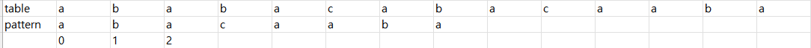
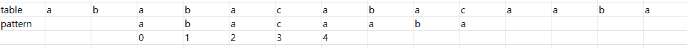
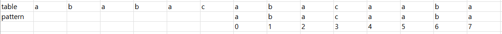
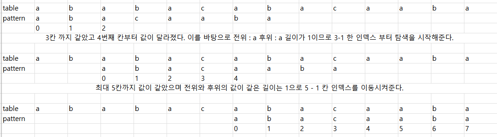
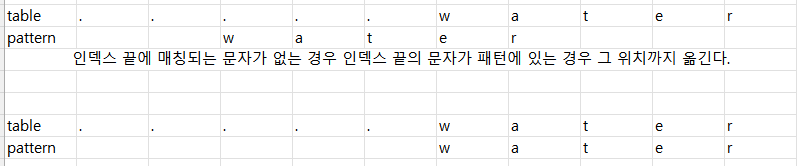

# 유니코드 인코딩 (UTF : Unicode Transformation Format)

 - UTF-8 (Web)
   - MIN : 8bit, MAX : 32bit(1 Byte * 4)
 - UTF-16 (in windows, java)
   - MIN : 16bit, MAX : 32bit(2 Byte * 2)
 - UTF-32 (in unix)
   - MIN : 32bit, MAX: 32bit(4 Byte * 1)

# 문자열

 - char 타입 없음
 - 텍스트 데이터 방법이 통일됨
 - 문자열 기호
   - '(홑따옴표), "(쌍따옴표), '''(홑따옴표 3개), """(쌍따옴표 3개)
   - "+" 연결(Concatenation) => 문자열 + 문자열 : 이어 붙이는 역할
   - "*" 반복 => 문자열 * 수 : 수만큼 문자열 반복
 - 문자열은 시퀸스 자료형으로 분류되고, 시퀸스 자료형에서 사용할 수 있는 인덱싱, 슬라이싱 연산 사용 가능
 - 제공되는 메소드
   - replace() => replace("a", "b") : a문자를 b로 변환
   - split() => split("/") : "/"를 기준으로 문자를 나눔
   - isalpha() => abc.isalpha() : "abc"가 문자인지 판단
   - find() => abc.find("d") : "abc"에서 "d" 가 있는지 찾아줌
 - immutable이라 요소값을 변경할 수 없다.

### 문자열 뒤집기

```python
    s = "Reverse this strings" # sgnirts siht esreveR
    s = s[::-1]
    s = list(s)
    s.reverse()
    s = "".join(s)
```

# 패턴 매칭

 - 브루트포스(Brute Force)
 - 카프-라빈 알고리즘
 - KMP 알고리즘
 - 보이어-무어 알고리즘

## 브루트포스(Brute Force)

 - 모든 문자열의 처음부터 끝까지 차례로 순회하며 패턴 내 문자들을 하나씩 모두 비교하는 방법
    ```python
        t = [1, 2, 3, 5, 4, 6, 2, 1]
        p = [4, 6, 2, 1]
        # t 리스트 길이
        t_length = len(t)
        # p 리스트 길이
        p_length = len(p)
        # t, p 의 시작 인덱스
        t_index = 0
        p_index = 0
        # p_index 값과 t_index 값이 각각 길이보다 작을때까지
        while p_index < p_length and t_index < t_length:
            # t[t_index] 값과 p[p_index] 값이 같지 않을때
            if t[t_index] != p[p_index]:
                # t_index에 p_index 값을 뻄
                t_index -= p_index
                # p_index에 -1을 넣어줌
                p_index = -1
            # 반복문 끝날 떄마다 t_index, p_index 값을 각각 +1 해줌
            t_index += 1
            p_index += 1
        
        if p_index = p_length:
            print("find")
        else:
            print("no")
    ```
 - 최악의 경우 모든 위치 패턴을 비교해야기 때문에 O(MN)의 시간 복잡도를 가짐 => 10,000인 문자열에서 80인 패턴을 찾으면 800,000 번 비교가 일어난다.

## KMP 알고리즘

 - 불일치가 발생한 텍스트의 앞 부분에 어떤 문자가 있는지 알고있기 때문에, 발생한 앞 부분에 대하여 다시 비교하지 않고 매칭을 수행
 - 패턴을 전처리하여 배열 next[M]을 구해서 잘못된 시작을 최소화함
 - 시간 복잡도 : O(M+N)

    

 - table 값과 pattern 값을 비교해가며 최대로 겹치는 인덱스 길이를 찾게된다.
 - 이렇게 찾은 후 위의 결과에서는 "aba" 가 나오며 이 값을 앞에서 끝에서 동시에 탐색을 시작한다.
   - 왼쪽 : "a" / 오른쪽 "a" 이렇게 전위와 후위가 같은 경우 기억해둔 후 최장길이의 전위와 후위가 같은 값을 찾는다.
 - 찾은 최장길이 만큼과 매칭이 되지않았던 인덱스 값의 차만큼 pattern을 탐색할 길이를 옮겨준다.

    

 - 이동한 인덱스 길이 이후부터 탐색을 시작하여 매칭이 되지 않은 인덱스 까지 최대값을 찾아낸다.
   - 이후 위의 방식과 마찬가지로 "abaca"가 나오게 되며 이를 바탕으로 전위와 후위의 길이를 늘려가며 전위와 후위의 길이가 같은 것을 찾는다.
      1. 전위 : "a" / 후위 "a"
      2. 전위 : "ab" / 후위 "ac"
      3. 전위 : "abc" / 후위 "aca"
 - 길이가 최대 1로 5 - 1 인덱스 위치를 이동시켜준다.

    

 - 이렇게 값을 이동시켜줬을 경우 원하는 값을 찾거나 리스트 범위가 끝나서 없다고 판단하거나 둘 중 하나의 결과가 나오게 된다.

    

## 보이어-무어 알고리즘

 - 오른쪽 => 왼쪽으로 비교
 - 대부분 소프트웨어에서 채택하는 알고리즘
 - 패턴 오른쪽 끝 문자가 불일치 하고 이 문자가 패턴 내에 존재하지 않는 경우, 이동 거리는 패턴길이 만큼 이동한다.

    

 - 자세한 개념은 아직 이해를 하지 못해서 좀 더 공부한 후 정리해서 올릴 예정