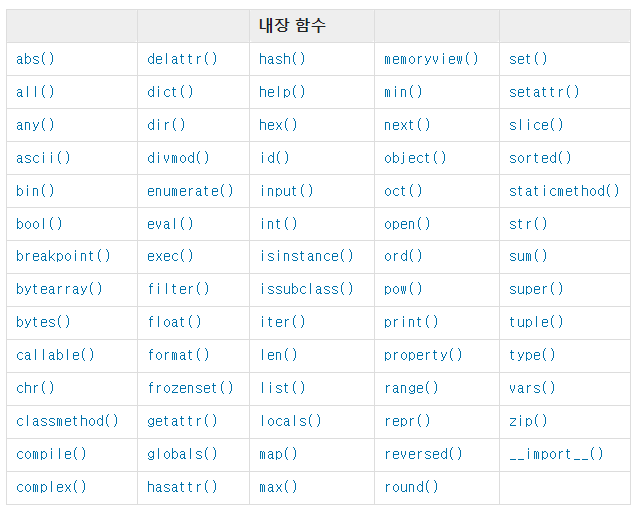

# 함수 : 특정 작업을 수행하기 위해 재사용 가능한 코드 묶음

  - 재사용성이 높아지고, 코드의 가독성과 유지보수성 향상

## 내장 함수 : 파이썬이 기본적으로 제공하는 함수

  

  [공식문서](https://docs.python.org/ko/3.9/library/functions.html)

## 함수 호출 : 함수를 실행하기 위해 함수의 이름을 사용하여 해당 함수의 코드 블록을 실행하는 것

  

## 함수 정의

 - 함수 정의는 def 키워드로 시작
 - def 이후 함수 이름 작성
 - 괄호안에 매개변수 정의 => 매개변수는 함수에 전달되는 값을 나타냄

 ```python
    def test(매개변수):
        "작성할 내용"
        "실행할 내용"
        "내용"
        
        return 반환할 값

    def greet(name):
        "여기에 함수에 들어갈 내용"
        message = "Hello" + name
        return message
 ```

 - 매개변수와 인자의 차이 => 매개변수는 함수를 '정의'할때 사용 / 인자는 함수를 '호출'할때 사용

 ```python
    def test(num1,num2):
        return num1+num2
    
    answer = test(1,2)
    # 위의 예시에서 매개변수는 num1, num2 이고 인자는 1,2 이다.
    # 반환값은 num1+num2 이다
    # 함수 호출 시 인자의 위치에 따라 전달되는 인자가 달라진다.
    answer = test(2,1)
    # 앞에거와 비슷하지만 인자의 위치가 달라졌기 때문에 주의해야 한다.
 ```

 ### Default Argument Values( 기본 인자 값 )
 
  - 함수 정의에서 매개변수에 기본 값을 할당하는 것
  - 함수 호출 시 인자를 전달하지 않으면, 기본값이 매개변수에 할당된다.
 
  ```python
     def greeting(name, age=30):
         print(f" 안녕하세요, {name}님! {age}살이시군요.")
     
     greet("Bob") # name 에는 Bob이 age 에는 기본값인 30이 출력된다.
     greet("Bob", 40) # name 에는 Bob이 age 에는 인자로 들어온 40이 출력된다.
  ```
 
 ### Keywrod Arguments( 키워드 인자 )
 
  - 함수 호출 시 인자의 이름과 함께 값을 전달하는 인자
  - 매개변수와 인자를 일치시키지 않고, 특정 매개변수에 값을 할당할 수 있음
  - 인자의 순서는 중요하지 않으며, 인자의 이름을 명시하여 전달
 
  ```python
     def greeting(name, age=30):
         print(f" 안녕하세요, {name}님! {age}살이시군요.")
     
     greet(name = "Bob", age = 35) # name 매개변수를 지정하여 "Bob"을 넣고 age 매개변수를 지정하여 35를 넣어준다.
     greet(age = 35, "Bob") # 키워드 인자의 위치는 위치 인자 뒤에 위치해야 하는데 위치 인자보다 앞에 존재해서 발생하는 오류이다.
     # positional argument follows keywrod argument
  ```
 
 ### Arbitrary Argument Lists( 임의의 인자 목록 )
 
  - 정해지지 않은 개수의 인자를 처리하는 인자
  - 함수 정의 시 매개변수 앞에 "*"를 붙여 사용하며, 여러 인자를 tuple로 처리
 
  ```python
     def calculate_sum(*args):
         print(args)
         total = sum(args)
         printf(f"합계: {total}")
     # (1, 2, 3) => 합계 : 6
     claulate_sum(1, 2, 3)
  ```
 
 ### Arbitrary Keywrod Argument Lists( 임의의 키워드 인자 목록 )
 
  - 정해지지 않은 개수의 키워드 인자를 처리하는 인자
  - 함수 정의 시 매개변수 앞에 "**"를 붙여 사용하며, 여러 개의 인자를 dictionary로 묶어 처리
 
  ```python
     def print_info(**kwargs):
         print(kwargs)
 
     print_info(name = "Eve", age = 30) # { 'name' : 'Eve', 'age' : 30}
  ```

 ### 함수 인자 권장 작성순서

  - 위치 -> 기본 -> 가변 -> 키워드 -> 가변 키워드
  - 호출 시 인자를 전달하는 과정에서 혼란을 줄일 수 있도록 함
  - 상황에 맞게 사용하는게 중요함 정해진 규칙은 없다.

## 함수와 Scope