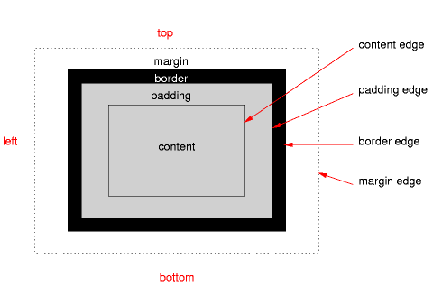
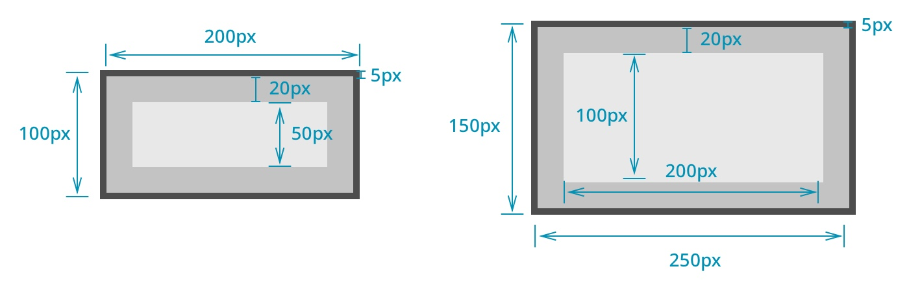
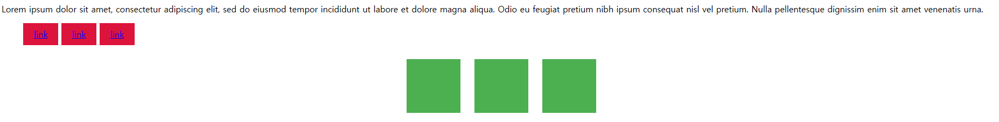

# CSS Layout

 - CSS Box Model
 - CSS Layout Position
 - CSS Layout Flexbox

## CSS Box Model

 - 모든 HTML 요소를 사각형 박스로 표현하는 개념
 - 내용(content), 안쪽 여백(padding), 테두리(border), 외부 간격(margin)으로 구성되는 개념

 

 - Margin : 이 박스와 다른 요소 사이의 공백 가장 바깥쪽 영역
 - Border : 콘텐츠와 패딩을 감싸는 테두리 영역
 - Content : 콘텐츠가 표시되는 영역
 - Padding : 콘텐츠 주위에 위치하는 공백 영역
 - Width & Height : 요소의 너비와 높이를 지정
  
 

 - CSS는 border가 아닌 content의 크기를 width 값으로 지정
 - box-sizing : border-box 선언시 width 기준을 border 기준으로 지정

## 박스 타입

 - block 타입
 - inline 타입

### block 타입

 ```HTML
    <h1>Normal flow</h1>
    <p>Lorem, ipsum dolor sit amet consect explicabo?</p>
    <div>
        <p>block 요소는 기본적으로 부모 요소 너비 100%를 차지하며, 자식 콘텐츠의 최대 높이를 취한다.</p>
        <p>block 요소의 총 너비와 총 높이는 content + padding + border width/height다.</p>
    </div>
    <p>block 요소는 서로 margin로 구분된다.</p>
    <p>inline 요소는 <span>이 것처럼</span> 자체 콘텐츠의 너비와 높이만 차지한다.
        그리고 inline 요소는 <a href="#">width나 height 속성을 지정 할 수 없다.</a>
    </p>
    <p>
        물론 이미지도 인라인 요소다.
        단, 이미지는 다른 inline 요소와 달리 width나 height로 크기를 조정할 수 있다.
    </p>
    <p>
        만약 inline 요소의 크기를 제어하려면 block 요소로 변경하거나 inline-block 요소로 설정해주어야 한다.
    </p>
 ```

 - 항상 새로운 행으로 나뉨
 - width와 height 속성을 사용하여 너비와 높이를 지정할 수 있음
 - 기본적으로 width 속성을 지정하지 않으면 박스는 inline 방향으로 사용 가능한 공간을 모두 차지함 ( 너비를 사용가능한 공간의 100%로 채우는 것 )
 - 대표적인 block 타입 태그 (h1 ~ h6, p, div)

### inline 타입

 - 새로운 행으로 나뉘지 않음
 - width와 height 속성을 사용할 수 없음
 - 수직 방향
   - padding, margins, borders가 적용되지만 다른 요소를 밀어낼 수 없음
 - 수평 방향
   - padding, margins, borders가 적용되어 다른 요소를 밀어낼 수 있음
 - 대표적인 inline 타입 태그
   - a, img, span

## display 속성

 - inline-block
 - none

### inline-block

 - inline과 block 요소 사이의 중간 지점을 제공하는 display 값
 - block 요소의 특징을 가짐
   - width 및 height 속성 사용 가능
   - padding, margin 및 border 로 인해 다른 요소가 밀려남
 - 요소가 줄 바꿈 되는 것을 원하지 않으면서 너비와 높이를 적용하고 싶은 경우에 사용

 ```HTML
  <!DOCTYPE html>
  <html lang="en">
  <head>
      <meta charset="UTF-8">
      <meta name="viewport" content="width=device-width, initial-scale=1.0">
      <title>Document</title>
      <style>
          span {
              margin: 20px;
              padding: 20px;
              width: 80px;
              height: 50px;
              background-color: lightblue;
              border: 2px solid blue;
              display: inline-block;
          }

          ul>li {
              background-color: crimson;
              padding: 10px 20px;
              display: inline-block;
          }

          .container {
              text-align: center;
          }

          .box {
              display: inline-block;
              width: 100px;
              height: 100px;
              background-color: #4CAF50;
              margin: 10px;
          }
      </style>
  </head>
  <body>
      <p>
          Lorem ipsum dolor sit amet, consectetur adipiscing elit, sed do eiusmod tempor incididunt ut labore et dolore magna aliqua. Odio eu feugiat pretium nibh ipsum consequat nisl vel pretium. Nulla pellentesque dignissim enim sit amet venenatis urna.
      </p>
      <ul>
          <li><a href="#">link</a></li>
          <li><a href="#">link</a></li>
          <li><a href="#">link</a></li>
      </ul>
      <div class="container">
          <div class="box"></div>
          <div class="box"></div>
          <div class="box"></div>
      </div>
  </body>
  </html>
 ```

 

### none

 - 요소를 화면에 표시하지 않고, 공간조차 부여되지 않음

## CSS Position

 - 요소를 Normal Flow에서 제거하여 다른 위치로 배치하는 것
 - 다른 요소 위에 올리기, 화면의 특정 위치에 고정시키기 등