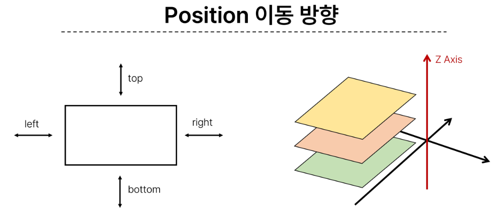
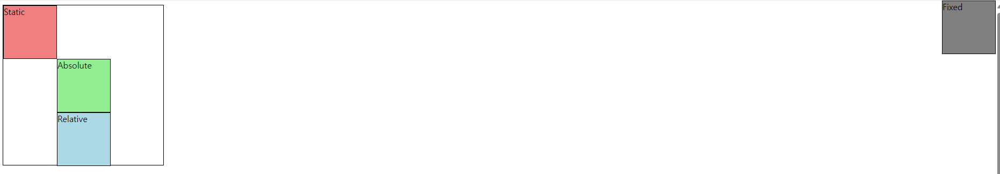
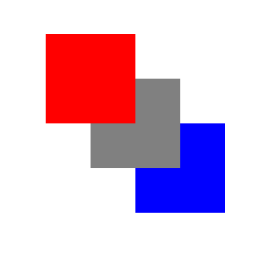
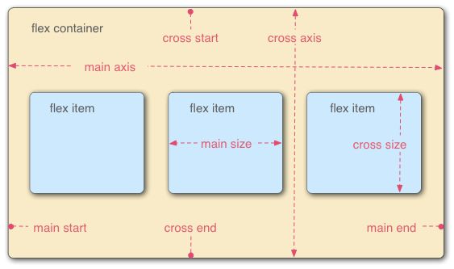
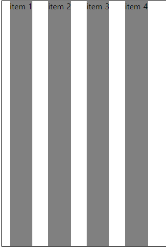
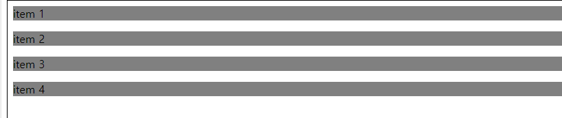

# CSS Layout

 - CSS Box Model
 - CSS Layout Position
 - CSS Layout Flexbox

## CSS Box Model

 - 모든 HTML 요소를 사각형 박스로 표현하는 개념
 - 내용(content), 안쪽 여백(padding), 테두리(border), 외부 간격(margin)으로 구성되는 개념

 

 - Margin : 이 박스와 다른 요소 사이의 공백 가장 바깥쪽 영역
 - Border : 콘텐츠와 패딩을 감싸는 테두리 영역
 - Content : 콘텐츠가 표시되는 영역
 - Padding : 콘텐츠 주위에 위치하는 공백 영역
 - Width & Height : 요소의 너비와 높이를 지정
  
 

 - CSS는 border가 아닌 content의 크기를 width 값으로 지정
 - box-sizing : border-box 선언시 width 기준을 border 기준으로 지정

## 박스 타입

 - block 타입
 - inline 타입

### block 타입

 ```HTML
    <h1>Normal flow</h1>
    <p>Lorem, ipsum dolor sit amet consect explicabo?</p>
    <div>
        <p>block 요소는 기본적으로 부모 요소 너비 100%를 차지하며, 자식 콘텐츠의 최대 높이를 취한다.</p>
        <p>block 요소의 총 너비와 총 높이는 content + padding + border width/height다.</p>
    </div>
    <p>block 요소는 서로 margin로 구분된다.</p>
    <p>inline 요소는 <span>이 것처럼</span> 자체 콘텐츠의 너비와 높이만 차지한다.
        그리고 inline 요소는 <a href="#">width나 height 속성을 지정 할 수 없다.</a>
    </p>
    <p>
        물론 이미지도 인라인 요소다.
        단, 이미지는 다른 inline 요소와 달리 width나 height로 크기를 조정할 수 있다.
    </p>
    <p>
        만약 inline 요소의 크기를 제어하려면 block 요소로 변경하거나 inline-block 요소로 설정해주어야 한다.
    </p>
 ```

 - 항상 새로운 행으로 나뉨
 - width와 height 속성을 사용하여 너비와 높이를 지정할 수 있음
 - 기본적으로 width 속성을 지정하지 않으면 박스는 inline 방향으로 사용 가능한 공간을 모두 차지함 ( 너비를 사용가능한 공간의 100%로 채우는 것 )
 - 대표적인 block 타입 태그 (h1 ~ h6, p, div)

### inline 타입

 - 새로운 행으로 나뉘지 않음
 - width와 height 속성을 사용할 수 없음
 - 수직 방향
   - padding, margins, borders가 적용되지만 다른 요소를 밀어낼 수 없음
 - 수평 방향
   - padding, margins, borders가 적용되어 다른 요소를 밀어낼 수 있음
 - 대표적인 inline 타입 태그
   - a, img, span

## display 속성

 - inline-block
 - none

### inline-block

 - inline과 block 요소 사이의 중간 지점을 제공하는 display 값
 - block 요소의 특징을 가짐
   - width 및 height 속성 사용 가능
   - padding, margin 및 border 로 인해 다른 요소가 밀려남
 - 요소가 줄 바꿈 되는 것을 원하지 않으면서 너비와 높이를 적용하고 싶은 경우에 사용

 ```HTML
  <!DOCTYPE html>
  <html lang="en">
  <head>
      <meta charset="UTF-8">
      <meta name="viewport" content="width=device-width, initial-scale=1.0">
      <title>Document</title>
      <style>
          span {
              margin: 20px;
              padding: 20px;
              width: 80px;
              height: 50px;
              background-color: lightblue;
              border: 2px solid blue;
              display: inline-block;
          }

          ul>li {
              background-color: crimson;
              padding: 10px 20px;
              display: inline-block;
          }

          .container {
              text-align: center;
          }

          .box {
              display: inline-block;
              width: 100px;
              height: 100px;
              background-color: #4CAF50;
              margin: 10px;
          }
      </style>
  </head>
  <body>
      <p>
          Lorem ipsum dolor sit amet, consectetur adipiscing elit, sed do eiusmod tempor incididunt ut labore et dolore magna aliqua. Odio eu feugiat pretium nibh ipsum consequat nisl vel pretium. Nulla pellentesque dignissim enim sit amet venenatis urna.
      </p>
      <ul>
          <li><a href="#">link</a></li>
          <li><a href="#">link</a></li>
          <li><a href="#">link</a></li>
      </ul>
      <div class="container">
          <div class="box"></div>
          <div class="box"></div>
          <div class="box"></div>
      </div>
  </body>
  </html>
 ```

 

### none

 - 요소를 화면에 표시하지 않고, 공간조차 부여되지 않음

## CSS Layout
 - 각 요소의 위치와 크기를 조정하여 웹 페이지의 디자인을 결정하는 것
   - Display
   - Position
   - Float
   - Flexboc

### CSS Position

 

 - 요소를 Normal Flow에서 제거하여 다른 위치로 배치하는 것
 - 다른 요소 위에 올리기, 화면의 특정 위치에 고정시키기 등

 ```HTML
 <!DOCTYPE html>
<html lang="en">
<head>
    <meta charset="UTF-8">
    <meta name="viewport" content="width=device-width, initial-scale=1.0">
    <style>
        * {
            box-sizing: border-box;
        }

        body {
            height: 1500px;
        }

        .container {
            position: relative;
            height: 300px;
            width: 300px;
            border: 1px solid black;
        }

        .box {
            height: 100px;
            width: 100px;
            border: 1px solid black;
        }

        .static {
            position: static;
            background-color: lightcoral;
        }

        .absolute {
            position: absolute;
            background-color: lightgreen;
            top: 100px;
            left: 100px;
        }

        .relative {
            position: relative;
            background-color: lightblue;
            top: 100px;
            left: 100px;
        }

        .fixed {
            position: fixed;
            background-color: gray;
            top: 0;
            right: 0;
        }
    </style>
    <title>Document</title>
</head>
<body>
    <div class="container">
        <div class="box static">Static</div>
        <div class="box absolute">Absolute</div>
        <div class="box relative">Relative</div>
        <div class="box fixed">Fixed</div>
    </div>
</body>
</html>
 ```

 

 1. static
    - 기본값
    - 요소를 Normal Flow에 따라 배치
 2. relative
    - 요소를 Normal Flow에 따라 배치
    - 자기 자신을 기준으로 이동
    - 요소가 차지하는 공간은 static일 떄와 같음
 3. absolute
    - 요소를 Normal Flow에서 제거
    - 가장 가까운 relative 부모 요소를 기준으로 이동
    - 문서에서 요소가 차지하는 공간이 사라짐
 4. fixed
    - 요소를 Normal Flow에서 제거
    - 현재 화면영역(viewpoint)을 기준으로 이동
    - 문서에서 요소가 차지하는 공간이 없어짐
 5. sticky
    - 요소를 Normal Flow에 따라 배치
    - 요소가 일반적인 문서 흐름에 따라 배치되다가 스크롤이 특정 임계점에 도달하면 그 위치에서 고정됨(fixed)
    - 만약 다음 sticky 요소가 나오면 다음 sticky 요소가 이전 sticky 요소의 자리를 대체
      - 이전 sticky 요소가 고정되어 있던 위치와 다음 sticky 요소가 고정되어야 할 위치가 겹치기 때문

### z-index

 - 요소가 겹쳤을 때 어떤 요소 순으로 위에 나타낼 지 결정
 - 정수 값을 사용해 Z축 순서를 지정
 - 더 큰 값을 가진 요소가 작은 값의 요소를 덮음

 

 ```HTML
 <!DOCTYPE html>
<html lang="en">
<head>
    <meta charset="UTF-8">
    <meta name="viewport" content="width=device-width, initial-scale=1.0">
    <style>
        .container {
            position: relative;
        }

        .box {
            position: absolute;
            width: 100px;
            height: 100px;
        }
        
        .red {
            background-color: red;
            top: 50px;
            left: 50px;
            z-index: 3;
        }

        .green {
            background-color: gray;
            top: 100px;
            left: 100px;
            z-index: 2;
        }

        .blue {
            background-color: blue;
            top: 150px;
            left: 150px;
            z-index: 1;
        }
    </style>
    <title>Document</title>
</head>
<body>
    <div class="container">
        <div class="box red"></div>
        <div class="box green"></div>
        <div class="box blue"></div>
    </div>
</body>
</html>
 ```

### CSS Layout Flexbox

 - 요소를 행과 열 형태로 배치하는 1차원 레이아웃 방식

#### 구성 요소

 

 - main axis(주 축)
   - flex item들이 배치되는 기본 축
   - main start에서 시작하여 main end 방향으로 배치
 - cross axis(교차 축)
   - main axis에 수직인 축
   - cross start에서 시작하여 cross end 방햐응로 배치
 - Flex Container
   - display: flex; 혹은 display: inline-flex; 가 설정된 부모 요소
   - 이 컨테이너의 1차 자식 요소들이 Flex Item이 됨
   - flexbox 속성 값들을 사용하여 자식 요소 Flex Item들을 배치
 - Flex Item
   - Flex Container 내부에 레이아웃 되는 항목

#### 레이아웃 구성

 1. Flex Container 지정
    - flex item은 기본적으로 행으로 나열
    - flex item은 주축의 시작 선에서 시작
    - flex item은 교차축의 크기를 채우기 위해 늘어남

 

 2. Flex-direction 지정
    - flex item이 나열되는 방향을 지정
    - column으로 지정할 경우 주 축이 변경됨
    - -reverse로 지정하면 시작 선과 끝 선이 서로 바뀜

 

 3. Flex-wrap 지정
    - flex item 목록이 flex container의 하나의 행에 들어가지 않을 경우 다른 행에 배치할지 여부 설정

 4. justify-content
    - 주 축을 따라 flex item과 주위에 공간을 분배

 5. align-content
    - 교차 축을 따라 flex item과 주위에 공간을 분배
      - flex-wrap이 wrap 또는 wrap-reverse로 설정된 여러 행에만 적용됨
      - 한 줄 짜리 행에는 (flex-wrap이 nowrap으로 설정된 경우) 효과 없음

 6. align-items
    - 교차 축을 따라 flex item 행을 정렬

 7. align-self
    - 교차 축을 따라 개별 flex item을 정렬